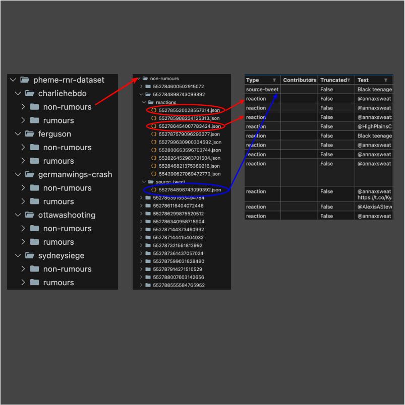
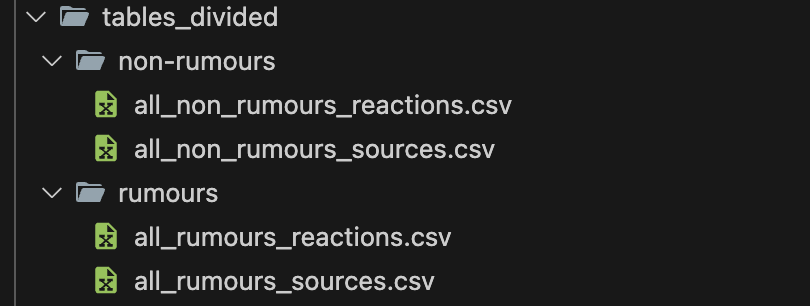

# Strategies and Models for User Classification: Optimizing Experience and Decision-Making

Il primo dataset che è stato analizzato è [Pheme](https://figshare.com/articles/dataset/PHEME_dataset_for_Rumour_Detection_and_Veracity_Classification/6392078) nel dettaglio questo dataset dispone di una serie di cartelle che a loro volta contendono 2 tipologie di cartelle rumors e non rumors che stanno ad identificare notizie vare da notizie che potrebbero essere veritere. All'interno di queste cartelle cosi ramificate sono presenti una serie di cartelle ciascuna delle quali conrtiene 2 cartelle source tweer all'interno del quelae è presente un json che sdescrive il commento e l'utente che lo ha scritto e la cartella response con allinterno n file con n numero ri risposte date al commento ciascuna con gli utenti. La prima operazioen che è queindi necessario fare è quella di semplicficare la struttura di questi dati e renderli più facili da utilizzaree.
## Preprocessing dati
Durante la fase di preprocessing il primo passo è statoq uello di cambiare stuttura e formato senza occuparci della relativa sintassi. iò che è stato fatto è la realizzazione di uno script chiamato create_table.py che si occupava sostanzialmente di semplifire i file in questo modo: la cartella table conteneva direttamente 2 sottocartelle chiamate rumors e non rumors. All'interno di questo vengono direttamente salvate delle tabelle che mappano tutti i file JSON nel seguente ordine: tweet e tutte le response. Graficamente mostrato in figura  
A eusto punto noi abbiamo m tabelli in cui in ogni tabella ho rispettivament il tweet alla prima posizione e tutte le altre righe le risposte. Lo step successivo è quindi quello di compattare tutte le abelle in un unica tabella. Nel dettaglio sono state realizzate 4 tabelle divise in rumors e non rumors e in tweet e response così come mostrato in figura 
Fatto questo adesso lo step successivo è quello di poter classificare o clusterizzare i nostri utenti per dividerli in tipologie. Sono state effettuate dunque differenti tipologie di classificazione con l'obiettivo di controntare i parametri e ottinere delle classificazioni sempre più a grana fina.


## Primo approccio clustering per Utente

Dopo aver letto i dati dal CSV:
- **Selezione di colonne specifiche:** Vengono mantenute solo le colonne rilevanti:
  - `user_screen_name`
  - `text`
  - `user_followers_count`
  - `user_friends_count`
  - `user_statuses_count`
  - `retweet_count`
  - `favorite_count`
- **Eliminazione dei dati mancanti:** Le righe con valori nulli vengono eliminate.


## Creazione di nuove metriche

Vengono calcolati due nuovi indicatori utili per l'analisi:

- **Engagement Rate:** Una misura del coinvolgimento dell'utente calcolata come:
  ```math
  Engagement Rate = (retweet_count + favorite_count) / (user_followers_count + 1) 
  ```
  (Il +1 evita divisioni per zero).
   ```math
  Follower-Friend Ratio = user_followers_count / (user_friends_count + 1) 
  ```

## Standardizzazione dei dati

Per rendere i dati adatti al clustering, si utilizza `StandardScaler` per standardizzare le seguenti caratteristiche:
- **Engagement Rate**: Tasso di coinvolgimento.
- **Follower-Friend Ratio**: Rapporto tra follower e amici.
- **User Followers Count**: Numero di follower dell'utente.
- **User Statuses Count**: Numero di stati pubblicati dall'utente.

La standardizzazione elimina differenze di scala tra le caratteristiche.


## Applicazione del K-Means Clustering

Un modello di clustering K-Means viene utilizzato per dividere gli utenti in **3 cluster**. I passaggi sono:
1. Calcolo dei centri dei cluster in base ai dati standardizzati.
2. Assegnazione di ogni utente a uno dei 3 cluster.

L'assegnazione del cluster viene salvata nella colonna:
- `number_of_cluster`


## Riduzione dimensionale con PCA

Si utilizza il metodo PCA (Principal Component Analysis) per ridurre i dati a due dimensioni principali:
- **PCA1**: La prima componente principale.
- **PCA2**: La seconda componente principale.

Questo consente una visualizzazione più semplice dei cluster.
## Visualizzazione

Il clustering viene rappresentato graficamente con un grafico a dispersione:
- Ogni punto rappresenta un utente.
- I colori indicano il cluster di appartenenza.
- Gli assi rappresentano le componenti principali:
  - **PCA1**
  - **PCA2**


Esportazione dei dati

I risultati vengono salvati in un file CSV con le seguenti colonne:
- **`screen_name`**: Nome dell'utente.
- **`text`**: Testo associato.
- **`number_of_cluster`**: Numero del cluster assegnato.