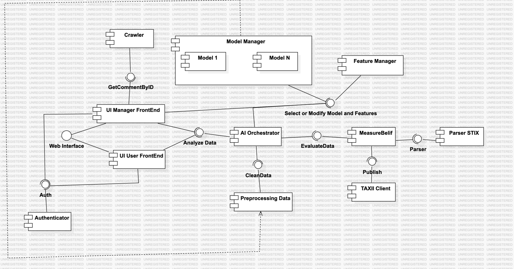
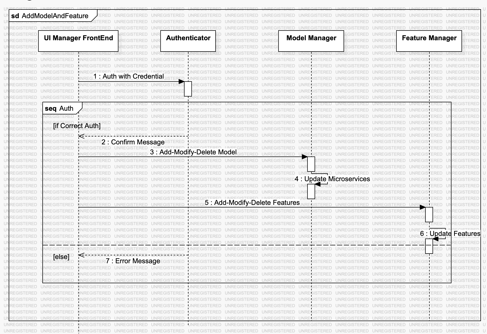
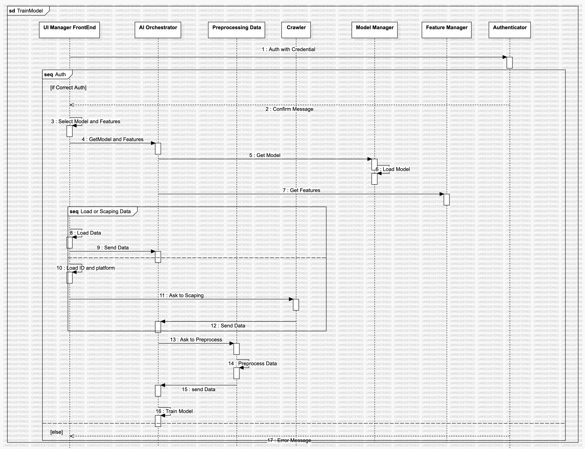
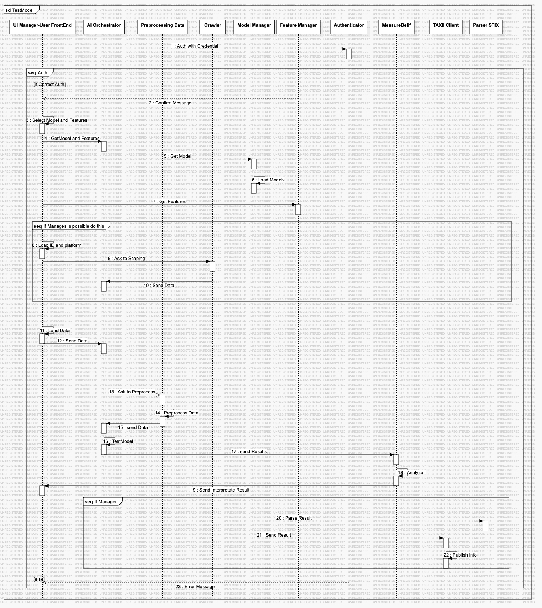

# Updates 07/10

In terms of activities UNICAMPANIA devoted itself to the formal definition of the architecture of the microservice system, using UML diagrams to represent in detail the structure and behavior of the system. In particular, Sequence Diagram and Component Diagram were developed, with the aim of illustrating the interactions between the various components of the system and the sequence of operations required to achieve the intended functionality.

## Component Diagram
The microservice architecture is shown in the following component. This structure divides the application into independent, interconnected units, promoting scalability, resilience, and easier management of individual services.

1. Crawler is responsible for acquiring data from external sources. This component, in turn, comprises different microservices, each dictated by the API of the site from which data is to be taken.
2. Model Manager manages different Machine and Deep Learning (ML/DL) models the system uses. The other models are voluntarily represented as components since it is intended to give the idea that these are always available for use. 
3. Feature Manager handles the management of different techniques for feature extraction
4. UI Manager FrontEnd and UI User FrontEnd The “UI Manager FrontEnd” and “UI User FrontEnd” are two front ends. Respectively, UI Manager FrontEnd is intended for administrators and enables the management of models, their training, and possible data testing. UI User FrontEnd is designed for all users and is nothing more than an interface that exposes functionality limited to testing. And it does not allow the TAXII API to be used. 
5. Authenticator is the component that is responsible for validating credentials and distinguishing administrators from ordinary users. 
6. AI Orchestrator is a component that coordinates the activities of training and testing data. It handles requests for different types of learning models and other types of feature extraction. It is also responsible for coordinating the functionality of the preprocessing and parser component.
7. Preprocessing Data deals with, as the name implies, data preprocessing. 
8. MeasureBelief This component measures the “belief” of different individuals given a preset of parameters.
9. STIX Parser: A component specifically for parsing data in the STIX (Structured Threat Information Expression) format, used to represent cyber threat information.
10. TAXII Client This component is a client for the TAXII (Trusted Automated eXchange of Indicator Information) protocol, used to share cyber threat information. It cooperates with the “STIX Parser” to capture and publish data in a standardized way.

## Sequence Diagram: Adding, Editing, and Deleting Models and Features.
The first diagram represents the process of adding, editing, or deleting a model or feature within the system. The flow begins with the interaction between the FrontEnd UI Manager and the Authenticator for credential verification. This ensures that only administrators have access to advanced features. Once authentication is successful, the administrator can add, edit, or delete a template or feature. The FrontEnd UI Manager forwards the request to the Model Manager or Feature Manager, depending on the nature of the change. The Model Manager is responsible for updating the microservices that host models, while the Feature Manager manages changes or additions to feature extraction methodologies.

## Training a Model
The second diagram represents the training flow of a model. Again, the process begins with authentication, where the FrontEnd UI Manager interacts with the Authenticator to verify the user's credentials. Once the user is authenticated, the administrator can select the model and feature extraction type from those available that are required for training through the UI Manager FrontEnd. The AI Orchestrator plays a key role in this process, coordinating the selection of the model from the Model Manager and features from the Feature Manager. Next, the administrator can manually upload the necessary data or request that the Crawler collect this data from external sources. The collected data is sent to the AI Orchestrator, which then passes it to the Preprocessing Data component, which performs the necessary operations to prepare the data and sends it back to the AI Orchestrator. At this point, the model can be trained using the data. 

## Testing a Model
The third diagram represents the testing flow of a trained model and highlights the differences between the operations performed by an administrator and those performed by an ordinary user. The flow mirrors the train for the first part, particularly until the end of model testing. After analysis, the results are sent to the front end, to the STIX Parser for standardized formatting, and then to the TAXII Client for publication. This ensures that the results can be used uniformly and shared with other systems securely and automated. In the case of ordinary users, the process is essentially the same except for publication and the possibility of scraping with the crawler. However, in the case of users, the tool is limited to the ability to upload data only.

